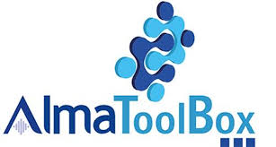

# Introduction

**This Extension allows you to integrate Dynatrace functionality into the world of AzureDevOps**

**The Extension has been developed in collaboration with Dynatrace Team**

 

powered by AlmaToolBox(r), the Almaviva brand dedicated to devops.

 

## Content 

- Dynatrace Integration Get Problems by Tag: allows you to recover problems related to all applications related to a given TAG.
- Dynatrace Integration Set Metrics: allows you to create an anomaly detection on Dynatrace starting from a .json file to upload.
- Dynatrace Integration Create Tags: allows you to create a specific tag on Dynatrace starting.
- Dynatrace Integration Create Events: allows you to create an event on Dynatrace starting from a .json file to upload.

### Dynatrace Integration Get Problems by Tag

By using this task it is possible to recover the problems related to all the applications related to a given TAG and obtain an error or a warning within the pipeline based on the value of the "problem error count" and "problem warning count" fields.

Task content:

- dynatraceendpoint service/server endpoint (required): connection to the dynatrace environment:

  - API Token: authentication token to the service. Must have permission to recover problems from server
  - service url: service access url, including any EnvironmentID

- Dynatrace apimethod (required): the API method to be called for the use of the getProblems functionality. the connection url will be composed as follows:

  > $ apiurl + "api/v1/" + $ apimethod

  Default "*problem/feed*"

- Dynatrace timeRange (required): the time interval within which to recover the problems. Default "* 3days *"

- Dynatrace tag (required): the tag for which to recover problems.

- problem warning count (required): the number of problems for which the pipeline will return a warning.

- problem error count (required): the number of problems for which pipeline is considered failed.

### Dynatrace Integration Set Metrics

Through this task it is possible to set a specific rule (anomaly detection) starting from a specific JSON for the applications referring to a specific tag.

Task content:

- dynatraceendpoint service / server end point (required): connection to the dynatrace environment:

  - API Token: authentication token to the service. Must have permission to recover from problems
  - service url: service access url, including any EnvironmentID

- Dynatrace apimethod (required): the API method to be called for the use of the getProblems functionality. the connection url will be composed as follows:

  > $ apiurl + "api/config/v1/" + $ apimethod

  Default "*anomalyDetection/metricEvents*"

- Dynatrace appservicename: it is possible to replace a value with a pipeline variable within the reference json, in order to make the json representing the metric customizable at runtime.
  It means that within the JSON the keyword APPSERVICE (key sensitive) will be replaced with the value of this field.

- JSON metric file (required): the path to the json file representing the metric to be implemented.
  example json file: 

```json
{
  "metadata": {
    "configurationVersions": [
      4,
      2
    ],
    "clusterVersion": "0.0.0."
  },
  "metricId": "com.dynatrace.builtin:host.disk.bytesread",
  "name": "My metric event",
  "description": "This is the description for my metric event.",
  "aggregationType": "AVG",
  "severity": "CUSTOM_ALERT",
  "alertCondition": "ABOVE",
  "samples": 5,
  "violatingSamples": 3,
  "dealertingSamples": 5,
  "threshold": 80,
  "alertingScope": [
    {
      "filterType": "ENTITY_ID",
      "entityId": "HOST-000000000001E240"
    },
    {
      "filterType": "TAG",
      "tagFilter": {
        "context": "CONTEXTLESS",
        "key": "someKey",
        "value": "someValue"
      }
    }
  ],
  "metricDimensions": [
    {
      "filterType": "ENTITY",
      "name": "disk",
      "index": 1,
      "nameFilter": {
        "value": "diskName",
        "operator": "EQUALS"
      }
    }
  ],
  "enabled": true,
  "unit": "KILO_BYTE_PER_SECOND"
} 
```


### Dinatrace integration Create Tags

Through this task it is possible to create a specific tag to which one or more applications refer in order to recover any problems or to set any metrics.

Task content:

- dynatraceendpoint service / server end point (required): connection to the dynatrace environment:

  - API Token: authentication token to the service. Must have permission to recover from problems
  - service url: service access url, including any EnvironmentID

- Dynatrace apimethod (required): the API method to be called for the use of the TAG functionality. the connection url will be composed as follows:

  > $ apiurl + "api/config/v1/" + $ apimethod

  Default "*autoTags*"

- Dynatrace appservicename (Optional): the name of the tag to be created refers to one or more APPSERVICE.

### Dynatrace Integration Create Events

Through this task it is possible to create a specific event starting from a specific JSON for the applications referring to a specific tag, with the possibility of replacing a variable within the document in order to be customizable at runtime.

Task content:

- dynatraceendpoint service/server endpoint (required): connection to the dynatrace environment:

  - API Token: authentication token to the service. Must have permission to recover from problems
  - service url: service access url, including any EnvironmentID

- Dynatrace apimethod (required): the API method to be called for the use of the getProblems functionality. the connection url will be composed as follows:

  > $ apiurl + "api/config/v1/" + $ apimethod

  Default "*events*"

- substitution element in json file: it is possible to replace a value with a pipeline variable within the reference json, in order to make the json representing the event customizable at runtime.
  It means that within the JSON the keyword APPSERVICE (key sensitive) will be replaced with the value of this field.

- JSON metric file (required): the path to the json file representing the event to created.
  example json file: 

```json
{
  "eventType": "CUSTOM_ANNOTATION",
  "attachRules": {
    "entityIds": [
      
    ],
    "tagRule": [
      {
        "meTypes": [
         "HOST"
        ],
        "tags": [
          {
            "context": "CONTEXTLESS",
            "key": "APPSERVICE"
          }
        ]
      }
    ]
  },
  "source": "Test",
  "annotationType": "defect",
  "annotationDescription": "The coffee machine is broken"
}
```

## Example of use

In your Azure Devops organization you can use these tasks to govern the deployment phase of an application by creating the necessary resources on Dynatrace and simultaneously monitor your application, finding any anomalies related to current or previous deployments. 

your deployment may be conditioned by the presence or absence of problems in what already exists, so the first step is to recover the problems of the application in the current version and, based on the result, behave accordingly.


as a positive result of the previous step, as a pre-step in the application deployment, we create the necessary resources for monitoring on dynatrace:

TAGS: update or creation of a new tag dedicated to the application

Anomaly Detection (metrics): setting rules for application monitoring

after successful deployment, we create an event that will correspond to the deployment of a new version of the application.


downstream of the deployment stage, we can foresee a testing stage of the application with a subsequent task for checking the presence of problems on dynatrace.


## Conclusion

Through the integration between Azure DevOps and Dynatrace, a runtime configuration of the monitoring component is obtained which adds to what is already automated in Azure Devops.